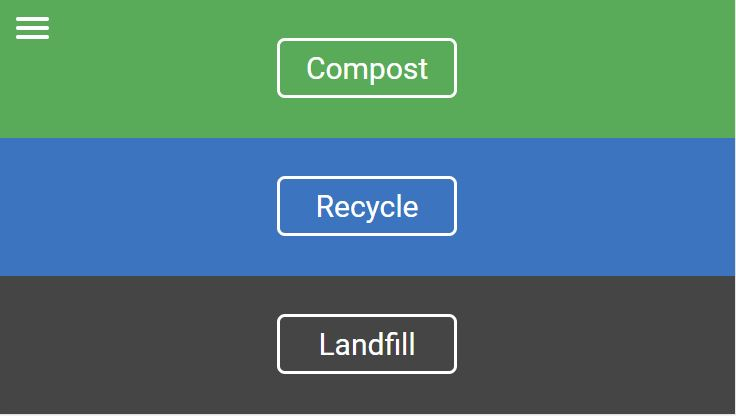
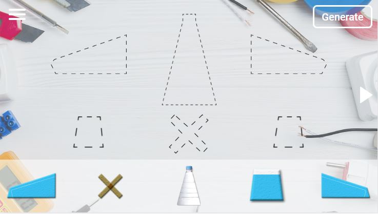
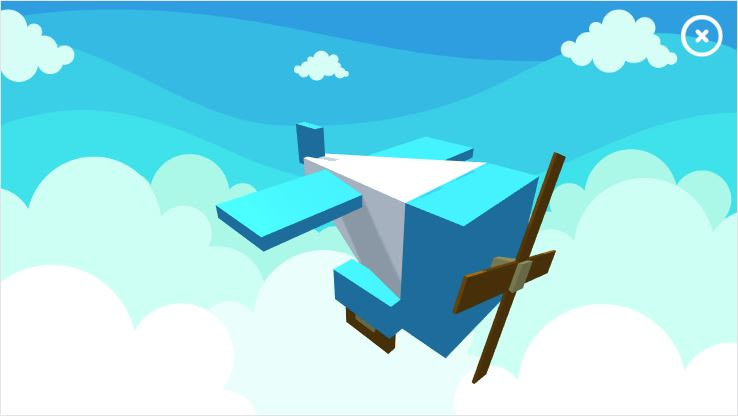
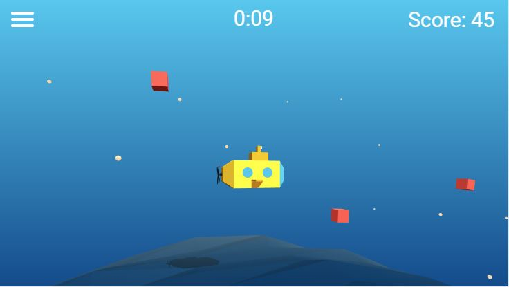
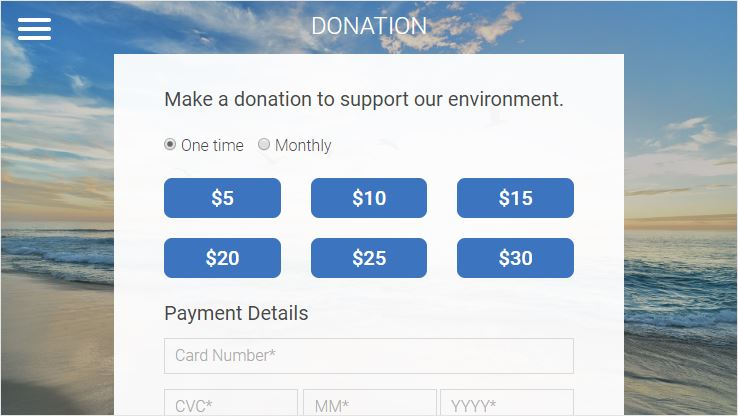

# TrashExpert
Trash Expert is an application that giving users a better understanding of recycling and play some small interactive games to inspire users. <br>
[Link to the demo](http://peterchangsite.com/aau/wnm617/final_project/)

## Description
This project is using Highcharts for showing recycling data, and we created some interactive 3D games with three.js. Also, Stripe platform has been used for payment method.

## Screen shots?
#### Learn page


#### Puzzle game



#### Three.js 3D game


#### Payment method


## How it works?
#### examples:
```javascript
//Draggable
$("#id").draggable();
//Droppable
$("#id").droppable({
    accept: "#id",
    tolerance:"touch",
    drop: function(event, ui) {
        $(this).attr("src","img/name.png");
        $("#id").css("visibility","hidden");
        drop2 = true;
    }
});
```
```javascript
//Three.js basic scene
function createScene() {	
	HEIGHT = window.innerHeight;
	WIDTH = window.innerWidth;
	scene = new THREE.Scene;

	scene.fog = new THREE.Fog(0xf7d9aa, 100, 950);
	
	aspectRatio = WIDTH / HEIGHT;
	fieldOfView = 60;
	nearObject = 1;
	farObject = 10000;
	camera = new THREE.PerspectiveCamera(
		fieldOfView,
		aspectRatio,
		nearObject,
		farObject
		);
	
	camera.position.x = -50;
	camera.position.z = 180;
	camera.position.y = 100;
	camera.rotation.y = 50;

	renderer = new THREE.WebGLRenderer({ 
		alpha: true, 
		antialias: true 
	});

	renderer.setSize(WIDTH, HEIGHT);	
	renderer.shadowMap.enabled = true;
	
	container = document.getElementById('world');
	container.appendChild(renderer.domElement);
	
	window.addEventListener('resize', handleWindowResize, false);
}
```
```javascript
//Game2 Collision(using vector3 for detecting)
function collision(){
	var oneTrash;
	var trashPos = new THREE.Vector3();
	var heroPos = submarine.mesh.position.clone();
	var score = $("#id").text();
	var score_int = parseInt(score);

	for (var i=0; i<this.collidableMeshList.length; i++){
		oneTrash = collidableMeshList[i];
		trashPos.setFromMatrixPosition( oneTrash.matrixWorld );

		if(trashPos.x>0 && trashPos.x<200 && trashPos.y>0){
			var xPoint = trashPos.x;
			var yPoint = trashPos.y - heroPos.y;

			if(xPoint > -30 && xPoint < 30 && yPoint <= 25 && yPoint >= -25){
				//console.log(score);
				collidableMeshList[i].scale.set(0,0,0);
				collidableMeshList.splice(i, 1);
				score_int = score_int + 5;
				$("#id").text(score_int);
			}
		}
	}
}
```
